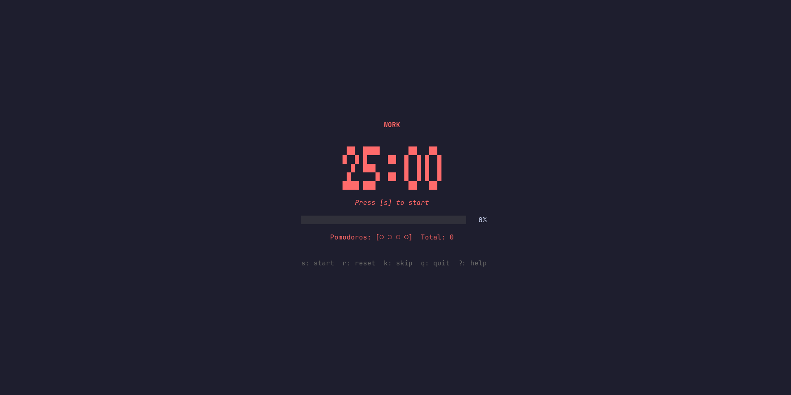

# pomo

A terminal-based pomodoro timer with an interactive TUI, session tracking, and statistics.



## Features

- Full-screen TUI with large ASCII timer display
- Work / Short Break / Long Break cycle with auto-advance
- Session persistence with BoltDB — your history survives restarts
- Resume unfinished sessions after closing the TUI
- Statistics with streak tracking, daily goals, and per-task breakdown
- Desktop notifications + terminal bell
- Configurable durations and intervals

## Installation

### Arch Linux (AUR)

```bash
# Prebuilt binary (no Go required)
yay -S pomo-cli-bin

# Or build from source
yay -S pomo-cli
```

### From source

```bash
go install github.com/lostf1sh/pomo@latest
```

### Manual build

```bash
git clone https://github.com/lostf1sh/pomo.git
cd pomo
go build -o pomo .
```

## Usage

```bash
# Start a pomodoro session
pomo start --task "coding"

# Start with custom work duration
pomo start --task "reading" --work 45m

# Resume the last unfinished session
pomo resume

# Running pomo without a subcommand also starts a session
pomo
```

### Keyboard Shortcuts

| Key | Action |
|-----|--------|
| `s` | Start / Pause |
| `r` | Reset current segment |
| `k` | Skip to next segment |
| `q` | Quit |
| `?` | Toggle help |

### Statistics

```bash
# All-time stats
pomo stats

# Filter by task
pomo stats --task "coding"

# Filter by period
pomo stats --period today
pomo stats --period week
pomo stats --period month

# Machine-readable output
pomo stats --json
```

### Configuration

```bash
# Show current config
pomo config show

# Modify settings
pomo config set --work 30m --short-break 10m
pomo config set --long-break 20m --interval 3
pomo config set --daily-goal 8
pomo config set --desktop false --bell true
```

Default configuration:

| Setting | Default |
|---------|---------|
| Work duration | 25m |
| Short break | 5m |
| Long break | 15m |
| Long break interval | 4 pomodoros |
| Daily goal | disabled |
| Desktop notifications | on |
| Terminal bell | on |

## Data Storage

| File | Location |
|------|----------|
| Config | `~/.config/pomo/config.json` |
| Database | `~/.local/share/pomo/pomo.db` |

## License

MIT
